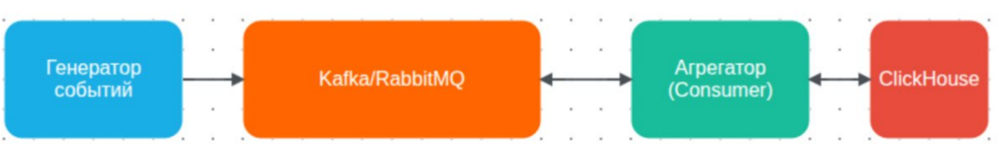

1. [Задание](#задание)
2. [Реализация](#реализация)



## Задание

Реализовать систему агрегации данных в реальном времени

Стек: 
Go, ClickHouse, Kafka/Rabbit

Разработать 2 сервиса.

1. Генератор событий (Producer)
2. Агрегирующий Consumer


## 1. Генератор событий (Producer)

Требования к генератору:

Структура события
```go
type PageViewEvent struct {
    PageID        string    `json:"page_id"`
    UserID        string    `json:"user_id"`
    ViewDuration  int       `json:"view_duration_ms"`
    Timestamp     time.Time `json:"timestamp"`
    UserAgent     string    `json:"user_agent,omitempty"`
    IPAddress     string    `json:"ip_address,omitempty"`
    Region        string    `json:"region,omitempty"`
    IsBounce      bool      `json:"is_bounce"` // Быстрый уход (<5 сек)
}
```
Задачи:

1.1. Режимы генерации (реализовать все):

- Регулярный поток: Постоянная генерация 1-10 событий в секунду
- Пиковые нагрузки: Периодические "bursts" по 100-1000 событий за 2 секунды
- Ночные периоды: Редкие события (1 в 10 секунд)

1.2. Типы событий:
- Нормальные просмотры: Длительность 10-600 секунд
- Броунсы: Длительность <5 секунд (10% событий)
- Ошибочные события: С преднамеренными ошибками в данных (5%):
     - Пустой page_id
     - Отрицательная длительность
     - Некорректный JSON
1.3. Отрабатываем паттерны работы с брокером:

Должны быть реализованы:
1. Синхронная отправка (для критичных данных)
2. Асинхронная отправка с callback
3. Batch отправка (накопить N сообщений или ждать X времени)
4. Ретри при ошибках с exponential backoff
*5. Разные стратегии партиционирования
   - По ключу (page_id)
   - Round-robin
   - Random

1.4. Дополнительные требования:

Добавить метрики: количество отправленных сообщений, ошибки, latency
Возможность динамического изменения скорости генерации через HTTP-эндпоинт
Запись дубликатов с одинаковым Message Key (1% случаев)

## 2. Агрегирующий Consumer

Требования к анрегатору:

2.1. Паттерны потребления.
Режимы чтения из брокера:
1. Batch consumer: Накопление N сообщений (100-10000) перед обработкой
2. Time-based consumer: Обработка каждые X секунд
3. Hybrid approach: Что наступит раньше (N сообщений или X секунд)
*4. Exactly-once семантика: Использование транзакций Kafka (по желанию)


2.2. Стратегии обработки:

A. Горячий путь (Hot Path):
-- Немедленная агрегация для real-time дашбордов
-- Использовать AggregatingMergeTree для промежуточных состояний

B. Холодный путь (Cold Path):
-- Подробное хранение для детального анализа
-- Использовать TTL для автоматического удаления/агрегации старых данных

2.3. Обработка ошибок:

Dead Letter Queue (DLQ) для некорректных сообщений !!! Обязательно
Ретри с exponential backoff при ошибках ClickHouse
*Компенсирующие транзакции (при откате Kafka транзакции) (по желанию)

2.4. Гарантии доставки:

At-least-once (реализовать обязательно)
Exactly-once (реализовать как продвинутый вариант)
*Ручное управление коммитами offset (по желанию)

## ClickHouse схема

Таблицы:
```sql
-- 1. Сырые данные (для детального анализа)
CREATE TABLE page_views_raw
(
    event_date    Date DEFAULT today(),
    event_time    DateTime64(3, 'UTC'),
    page_id       String,
    user_id       String,
    duration_ms   UInt32,
    user_agent    String,
    ip_address    IPv6,
    region        LowCardinality(String),
    is_bounce     UInt8,
    kafka_offset  Int64,
    kafka_partition Int32,
    processed_time DateTime DEFAULT now()
) ENGINE = MergeTree()
PARTITION BY toYYYYMM(event_date)
ORDER BY (event_date, page_id, user_id)
TTL event_date + INTERVAL 30 DAY
SETTINGS index_granularity = 8192;

-- 2. Агрегированные данные (минутные срезы)
CREATE TABLE page_views_agg_minute
(
    window_start  DateTime,
    page_id       String,
    view_count    AggregateFunction(sum, UInt64),
    total_duration AggregateFunction(sum, UInt64),
    unique_users  AggregateFunction(uniq, String),
    bounce_count  AggregateFunction(sum, UInt8)
) ENGINE = AggregatingMergeTree()
PARTITION BY toYYYYMM(window_start)
ORDER BY (window_start, page_id)
TTL window_start + INTERVAL 7 DAY;

-- 3. Агрегированные данные (часовые срезы - роллинг из минутных)
CREATE TABLE page_views_agg_hour
(
    window_start  DateTime,
    page_id       String,
    view_count    UInt64,
    avg_duration  Float32,
    unique_users  UInt64,
    bounce_rate   Float32
) ENGINE = SummingMergeTree()
ORDER BY (window_start, page_id);

-- 4. Dead Letter Queue для ошибок
CREATE TABLE processing_errors
(
    error_time    DateTime,
    raw_message   String,
    error_reason  String,
    kafka_offset  Int64,
    kafka_partition Int32
) ENGINE = MergeTree()
ORDER BY (error_time);
```

Материализованные представления:
```sql
-- 1. MV для минутной агрегации (из сырых данных)
CREATE MATERIALIZED VIEW page_views_raw_to_minute
TO page_views_agg_minute
AS
SELECT
    toStartOfMinute(event_time) AS window_start,
    page_id,
    sumState(1) as view_count,
    sumState(duration_ms) as total_duration,
    uniqState(user_id) as unique_users,
    sumState(is_bounce) as bounce_count
FROM page_views_raw
GROUP BY window_start, page_id;

-- 2. MV для часовой агрегации (из минутной)
CREATE MATERIALIZED VIEW page_views_minute_to_hour
TO page_views_agg_hour
AS
SELECT
    toStartOfHour(window_start) AS window_start,
    page_id,
    sum(view_count) as view_count,
    sum(total_duration) / sum(view_count) as avg_duration,
    uniq(unique_users) as unique_users,
    sum(bounce_count) * 100.0 / sum(view_count) as bounce_rate
FROM page_views_agg_minute
GROUP BY window_start, page_id;

-- 3. MV для фильтрации ошибок в DLQ
CREATE MATERIALIZED VIEW errors_mv
TO processing_errors
AS
SELECT
    now() as error_time,
    -- Здесь предполагается, что есть поле с исходным сообщением
    raw_message,
    'validation_error' as error_reason,
    kafka_offset,
    kafka_partition
FROM page_views_raw
WHERE page_id = '' OR duration_ms <= 0;
```
---
## Реализация
### 🚀 Быстрый старт
#### 1. Запуск инфраструктуры
```bash 
# Запуск всех сервисов (Kafka, ClickHouse, Kafka UI)
make up
   
# Проверка статуса
docker compose ps
```
Ожидаемый результат:
```
NAME                     STATUS
analytics-zookeeper      Up
analytics-clickhouse     Up (healthy)
analytics-kafka          Up
analytics-kafka-ui       Up
```
---
#### 2. Запуск Producer (Генератор событий)
```bash
# Создание билда producer
# Обычный режим (2 события/сек)
make producer

# Пиковая нагрузка (100 событий/сек)
GEN_MODE=peak make producer

# Ночной режим (1 событие/10 сек)
GEN_MODE=night make producer

# Синхронная отправка
PRODUCER_MODE=sync make producer

# Пакетная отправка
PRODUCER_MODE=batch BATCH_SIZE=100 BATCH_TIMEOUT=1s make producer
```
---
#### 3. Запуск Consumer (Агрегатор)

```bash
# В новом терминале
make consumer
```
---
#### 4. Проверка данных в ClickHouse
```bash
# Подключение к ClickHouse
make sql-client
```
##### Полезные запросы для проверки:
```sql
-- 1. Количество сырых событий
SELECT count() FROM page_views_raw;

-- 2. Последние 10 событий
SELECT 
    event_time, 
    page_id, 
    user_id, 
    duration_ms, 
    is_bounce 
FROM page_views_raw 
ORDER BY event_time DESC 
LIMIT 10;

-- 3. Минутная агрегация (правильный запрос для AggregatingMergeTree!)
SELECT 
    window_start,
    page_id,
    sumMerge(view_count) AS views,
    sumMerge(total_duration) AS total_duration_ms,
    uniqMerge(unique_users) AS unique_users,
    sumMerge(bounce_count) AS bounce_count
FROM page_views_agg_minute
GROUP BY window_start, page_id
ORDER BY window_start DESC
LIMIT 10;

-- 4. Часовая агрегация
SELECT 
    window_start,
    page_id,
    view_count,
    avg_duration,
    unique_users,
    bounce_rate
FROM page_views_agg_hour
ORDER BY window_start DESC
LIMIT 10;

-- 5. Ошибки (Dead Letter Queue)
SELECT 
    error_time, 
    error_reason, 
    kafka_offset 
FROM processing_errors 
ORDER BY error_time DESC 
LIMIT 10;

-- 6. Статус Materialized Views
SELECT 
    name, 
    engine 
FROM system.tables 
WHERE database = 'analytics' 
  AND name LIKE '%minute%' OR name LIKE '%hour%';
```

##### HTTP API (Producer)
Producer предоставляет эндпоинты на порту 8081:

Метод | Эндпоинт | Описание | Пример |
|-------|----------|----------|--------|
GET | /metrics | Статистика отправки | `curl localhost:8081/metrics` |
GET | /config | Текущая конфигурация | `curl localhost:8081/config` |
PUT | /config | Обновить конфигурацию | `curl -X PUT ... -d '{"pause":true}'` |
GET | /health | Health check | `curl localhost:8081/health` |

---
#### 5. Работа с Kafka
```
# Открыть Kafka UI в браузере
# http://localhost:8080

# Создать топик (если не создан автоматически)
make kafka-topics

# Просмотр сообщений через консоль Kafka
docker exec -it analytics-kafka kafka-console-consumer \
    --bootstrap-server localhost:9092 \
    --topic page_views \
    --from-beginning \
    --max-messages 10
```
---
#### 6. Управление инфраструктурой
```
# Получить все возможноые команды
make help

# Получить метрики
make metrics

# Поставить на паузу
make config-pause

# Возобновить
make config-resume

# Переключить в режим "пик"
make config-set
```
---
#### Архитектура системы
```
┌─────────────────┐      ┌─────────────────┐      ┌─────────────────┐
│   PRODUCER      │      │     KAFKA       │      │   CONSUMER      │
│  (cmd/producer) │ ───► │  (page_views)   │ ───► │ (cmd/consumer)  │
│  • Генерация    │      │  • Буферизация  │      │  • Валидация    │
│  • Метрики      │      │  • Партиции     │      │  • Batch INSERT │
│  • HTTP API     │      │  • Оффсеты      │      │  • DLQ          │
│  • Retry        │      │                 │      │  • Retry        │
└─────────────────┘      └────────┬────────┘      └────────┬────────┘
                                  │                        │
                                  ▼                        ▼
                         ┌─────────────────────────────────────┐
                         │           CLICKHOUSE                │
                         │  • page_views_raw (MergeTree)       │
                         │  • page_views_agg_minute + MV       │
                         │  • page_views_agg_hour (таблица)    │
                         │    └─ заполняется по расписанию     │
                         │  • processing_errors + MV           │
                         └─────────────────────────────────────┘
```

### Реализация требований:

| Требование | Статус | Файл |
|------------|--------|------|
| **Структура события PageViewEvent** | ✅ | [`internal/event/event.go`](internal/event/event.go) |
| **Режимы: regular/peak/night** | ✅ | [`cmd/producer/main.go`](cmd/producer/main.go) |
| **Типы событий: нормальные/броунсы/ошибки** | ✅ | [`internal/event/event.go`](internal/event/event.go) |
| **Синхронная/асинхронная отправка** | ✅ | [`internal/kafka/producer.go`](internal/kafka/producer.go) |
| **Batch отправка** | ✅ | [`internal/kafka/producer.go`](internal/kafka/producer.go) |
| **Retry с exponential backoff** | ✅ | [`internal/kafka/producer.go`](internal/kafka/producer.go) |
| **Партиционирование по ключу** | ✅ | [`internal/event/event.go`](internal/event/event.go) |
| **Метрики (count, errors, latency)** | ✅ | [`internal/metrics/metrics.go`](internal/metrics/metrics.go) |
| **HTTP API для управления** | ✅ | [`internal/http/server.go`](internal/http/server.go) |
| **Дубликаты сообщений (1%)** | ✅ | [`cmd/producer/main.go`](cmd/producer/main.go) |
| **Потребитель** | | |
| Batch consumer | ✅ | [`internal/kafka/consumer.go`](internal/kafka/consumer.go) |
| Валидация и DLQ | ✅ | [`cmd/consumer/main.go`](cmd/consumer/main.go) |
| Retry при ошибках ClickHouse | ✅ | [`cmd/consumer/main.go`](cmd/consumer/main.go) |
| At-least-once гарантии | ✅ | [`internal/kafka/consumer.go`](internal/kafka/consumer.go) |
| **ClickHouse** | | |
| Таблица page_views_raw | ✅ | [`schema/init.sql`](schema/init.sql) |
| Таблица page_views_agg_minute + MV | ✅ | [`schema/init.sql`](schema/init.sql) |
| Таблица page_views_agg_hour | ✅ | [`schema/init.sql`](schema/init.sql) |
| Dead Letter Queue | ✅ | [`schema/init.sql`](schema/init.sql) |
| **Инфраструктура** | | |
| Docker Compose | ✅ | [`docker-compose.yml`](docker-compose.yml) |
| Makefile с удобными командами | ✅ | [`Makefile`](Makefile) |
| Health checks | ✅ | [`docker-compose.yml`](docker-compose.yml) |

```

├── cmd/
│   ├── producer/
│   │   └── main.go          # Точка входа Producer + HTTP API
│   └── consumer/
│       └── main.go          # Точка входа Consumer
├── internal/
│   ├── event/
│   │   └── event.go         # Структура события + генераторы
│   ├── kafka/
│   │   ├── producer.go      # Kafka Producer с батчами и ретраями
│   │   └── consumer.go      # Kafka Consumer Group с батчингом
│   ├── clickhouse/
│   │   └── client.go        # ClickHouse клиент с Batch INSERT
│   ├── config/
│   │   └── config.go        # Загрузка конфигурации из env
│   ├── metrics/
│   │   └── metrics.go       # Метрики сервиса (атомарные счётчики)
│   └── http/
│       └── server.go        # HTTP сервер для /metrics, /config, /health
├── schema/
│   └── init.sql             # Инициализация ClickHouse (таблицы + MV)
├── docker-compose.yml        # Инфраструктура: Kafka, ClickHouse, UI
├── Makefile                  # Удобные команды для разработки
└── README.md                 # Этот файл
```
   


